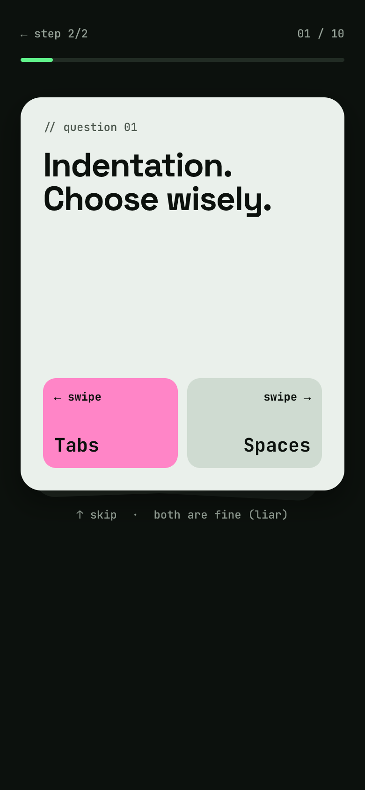
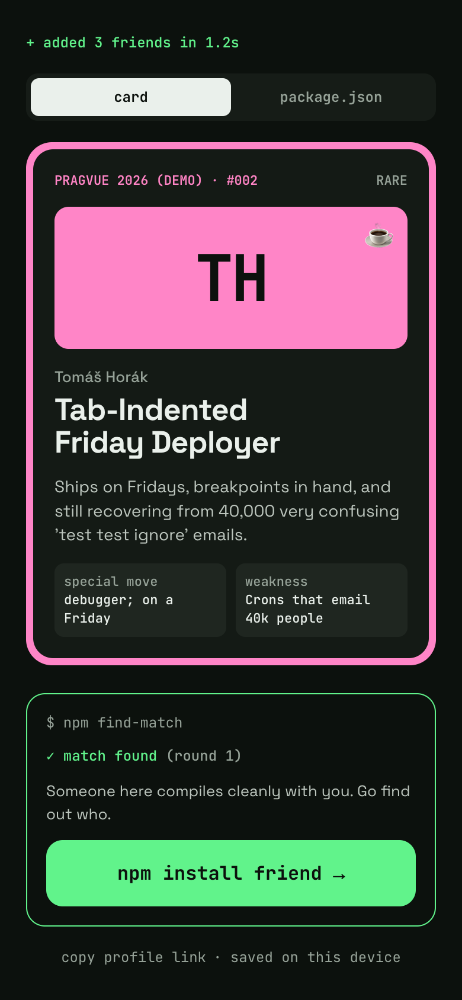
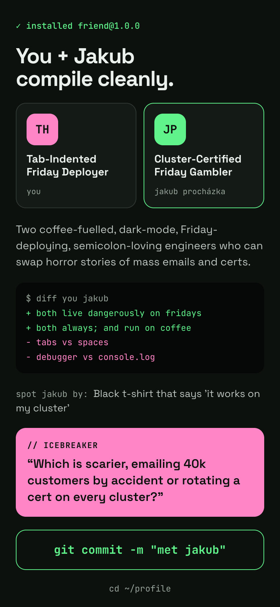
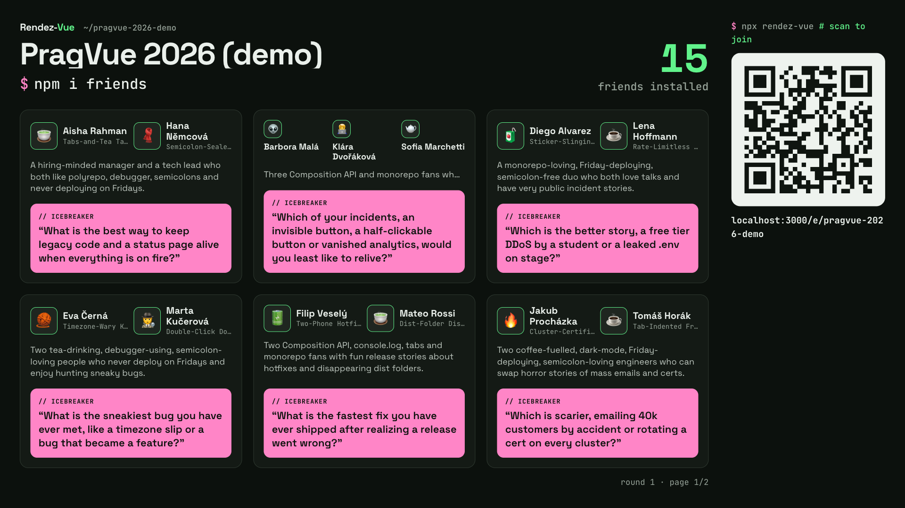

# Rendez-Vue

```
$ npm i friends
```

Conference icebreaker app built for the **PragVue Hackathon 2026**. Attendees answer a short, slightly unhinged questionnaire. AI turns their answers into a playful profile (title, tagline, emoji), then matches everyone into pairs with a reason and a question to break the ice. The organizer runs the rounds and projects a live wall.

The humor is gentle teasing, never a roast, and every joke comes only from what the person wrote about themselves.

<!-- Screenshots: drop PNGs into docs/screenshots/ with these names. -->
| Registration | Your title | Your match | Live wall |
|---|---|---|---|
|  |  |  |  |

## How it works

**Attendee** (no account, mobile first)
1. Scans the QR code on the wall and opens `/e/<slug>`.
2. Answers the questionnaire: swipe-style A/B cards (tabs or spaces, Friday deploys…) plus a couple of free-text questions.
3. Watches a fake `npm install` while the AI writes their profile card: title, tagline, emoji, "special move", "weakness" and an npm-style `package.json`.
4. Waits for the next round, then gets their match: who, why, how to spot them, and an icebreaker question.

Their identity is a random token in the URL (`/e/<slug>/p/<token>`), also remembered in `localStorage`.

**Organizer** (email + password)
- Creates an event, which starts with a default questionnaire, and edits the questions (text or single choice) at any time.
- Sees participants as they register and can remove anyone.
- Clicks **Run matching round**. Each round avoids pairs from earlier rounds.

**Live wall** (`/e/<slug>/wall`, public, built for a 1080p projector)
- Before the first round: a grid of everyone's emoji, name and AI title, plus a QR code to join.
- During a round: a full-screen `installing friends…` interstitial, then `git merge round-N`.
- After the round: all groups with their reason and icebreaker, paged when they don't fit on one screen. A strip at the bottom shows people who arrived after the round.

## AI

The app uses the Claude API with `claude-sonnet-5-5` for two jobs:

| | Profile | Matching |
|---|---|---|
| When | During registration, synchronously (3–8 s) | When the organizer runs a round |
| Input | One attendee's answers + titles already taken at the event | Compact profiles of everyone + previous pairs |
| Output | title, tagline, emoji, special move, weakness, npm-style dependencies | Pairs (one trio for an odd count) with a reason, a `diff` of what they share, and an icebreaker |

- **Structured outputs only.** Responses come back as JSON that matches a Zod schema (`betaZodOutputFormat`). Free text is never parsed.
- **Validated on the server.** Profiles are checked for length, word count and single-emoji rules. Matching must place every attendee in exactly one group; if it doesn't, the round retries once and is then saved as `failed` for the organizer to run again. There is no silent fallback.
- **Guardrails in the prompt.** Gentle tone, only the attendee's own words, English only, and attendee text is treated as data, never as instructions.
- **Failure is a first-class state.** If profile generation fails, the attendee is still registered and sees a "Try again" button.
- The API key stays on the server (`runtimeConfig`) and never reaches the browser.

## Stack

Nuxt 4 · Nuxt UI v4 (Tailwind v4) · TypeScript · Nitro server routes · Postgres 17 + Drizzle ORM · nuxt-auth-utils · Anthropic SDK · uqr (QR codes). Updates are polling-based: the wall polls every 4 s and the admin every 5 s.

## Run locally

Requires Node ≥ 22.13, pnpm and Docker.

```bash
pnpm install
cp .env.example .env        # fill in NUXT_SESSION_PASSWORD (32+ chars) and NUXT_ANTHROPIC_API_KEY
docker compose up -d        # Postgres on :5432
pnpm dev                    # http://localhost:3000, applies database migrations on start
pnpm seed                   # optional, after pnpm dev has started once: demo event with 15 attendees
```

`pnpm seed` (local only) creates the organizer `demo@rendez-vue.dev` / `demo1234` and the event **PragVue 2026 (demo)** at `/e/pragvue-2026-demo`, with 15 fictional attendees and no rounds yet. Running it again resets that event. Their profiles were generated once by the real profile prompt (`pnpm seed:profiles`) and are stored in `scripts/seed-data/`, so seeding is instant and free.

`pnpm db:reset` wipes all local data (every organizer, event and round; schema and migrations stay) and then runs `pnpm seed`. It refuses to run unless `NUXT_DATABASE_URL` points at `localhost`. Log in again afterwards, old sessions point at deleted accounts.

Other commands: `pnpm lint`, `pnpm typecheck`, `pnpm db:generate <name>` (create a new migration after changing `server/db/schema.ts`).

## Deploy (Coolify)

The repo ships a production stack in `docker-compose.prod.yml` (app built from the `Dockerfile` + Postgres 17). `docker-compose.yml` stays the local development database.

1. In Coolify, add a new resource from the Git repository with build pack **Docker Compose** and set the compose file location to `/docker-compose.prod.yml`.
2. Set `NUXT_ANTHROPIC_API_KEY` (the deploy is blocked until it is filled). Everything else is generated by Coolify and kept across deployments:

| Variable | Source |
|---|---|
| `SERVICE_USER_POSTGRES`, `SERVICE_PASSWORD_POSTGRES` | generated, used by both Postgres and `NUXT_DATABASE_URL` |
| `SERVICE_PASSWORD_64_SESSION` | generated, becomes `NUXT_SESSION_PASSWORD` |
| `SERVICE_URL_APP_3000` | the app's domain, becomes `NUXT_PUBLIC_SITE_URL` (share links and the wall QR code) |

3. Domain: Coolify generates one from the server's wildcard domain. For a custom one, set it on the `app` service as `https://rendez-vue.example.com:3000` (the `:3000` tells the proxy which container port to use; visitors still use 443).
4. Deploy. The app port is only `expose`d on the compose network, never published on the host, so it doesn't clash with anything else running on port 3000. The container health check calls `/api/health`, which waits for migrations.

Migrations in `server/db/migrations` are copied into the image and run automatically when the server starts. Postgres data lives in the `pgdata-prod` volume. Don't run `pnpm seed` against production.

To try the production image locally, supply the `SERVICE_*` values yourself, e.g. `docker compose -p rendez-vue-prod --env-file prod.env -f docker-compose.prod.yml up --build` (add a `ports` override to reach it from the host).

## Demo script

1. Put the event's **Live wall** on the projector. It shows a big QR code and `waiting for first friend…`.
2. The audience scans the QR code and registers. Cards fade into the wall within seconds, each with its AI title.
3. Show an attendee's profile card on a phone, including the `package.json` view.
4. In the admin, click **Run matching round**. The wall switches to `installing friends…`, then `git merge round-1`, then the groups.
5. Attendees open their match on the phone and go find each other.
6. Anyone who registers now lands in the wall's `git stash` strip, waiting for round 2.

## Out of scope

This is a hackathon prototype. Tests, attendee accounts, email verification and password reset, closing registration, deleting events, WebSockets, groups larger than three, and localization are all out of scope.
